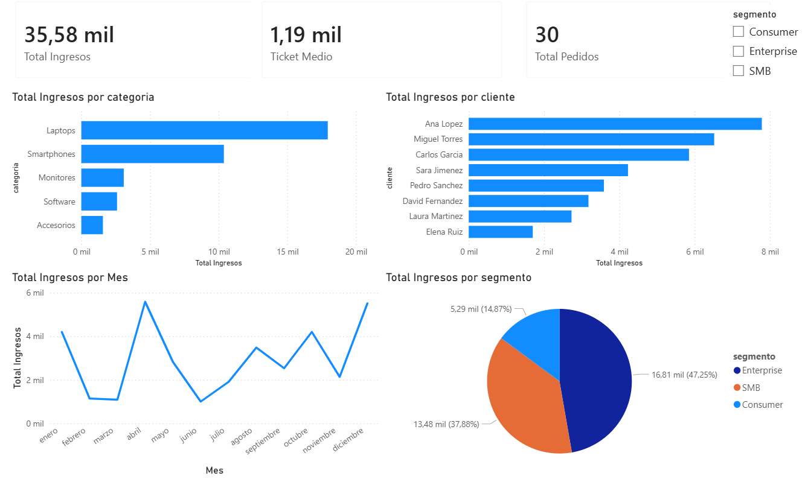

# 📊 Dashboard Ventas Tech — Pipeline Completo de Datos

## Descripción
Proyecto de análisis de ventas end-to-end que simula el flujo de trabajo 
real de un Data Analyst: desde el diseño de la base de datos hasta 
el dashboard interactivo en Power BI.

## Pipeline del proyecto
1. **MySQL/MariaDB** — Base de datos relacional con 4 tablas relacionadas
2. **Python + mysql.connector** — Extracción y análisis de datos
3. **Pandas + Matplotlib** — Limpieza, transformación y visualización
4. **Power BI** — Dashboard interactivo con medidas DAX

## Vista previa

## Modelo de datos
4 tablas relacionadas mediante claves foráneas:
- `clientes` — 8 clientes con ciudad y segmento
- `productos` — 13 productos tecnológicos con precio y stock
- `categorias` — 5 categorías de productos
- `pedidos` — 30 transacciones con fecha, cantidad y descuento

## Análisis realizados
- Total ingresos, ticket medio y total pedidos (tarjetas KPI)
- Ingresos totales por categoría de producto
- Ranking de clientes por valor generado
- Evolución de ingresos mes a mes
- Distribución de ingresos por segmento (Enterprise, SMB, Consumer)
- Segmentación interactiva por segmento

## Medidas DAX creadas
- `Total Ingresos = SUM(ventas_tech[total])`
- `Ticket Medio = AVERAGE(ventas_tech[total])`
- `Total Pedidos = COUNTROWS(ventas_tech)`

## Principales hallazgos
- **Laptops** es la categoría con más ingresos (49% del total)
- **Ana Lopez** es la cliente más valiosa con 7.784€
- **Enterprise** representa el 47% de los ingresos totales
- Picos de ventas en **abril y diciembre**

## Tecnologías utilizadas
- MySQL / MariaDB
- Python 3.13 + Pandas + Matplotlib
- Power BI Desktop + DAX
- Power Query
- Jupyter Notebook
- DBeaver

## Autor
Julián Carnevale — Data Analyst en formación
